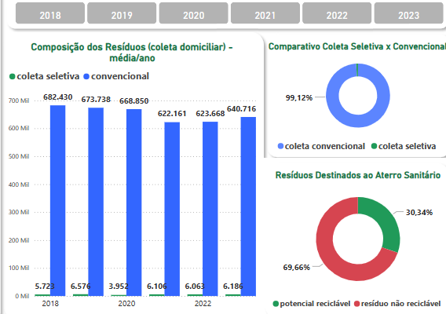
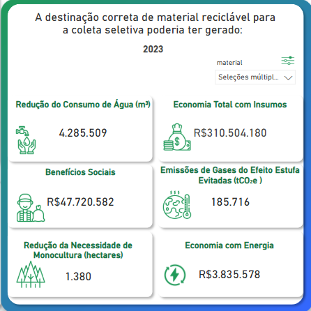
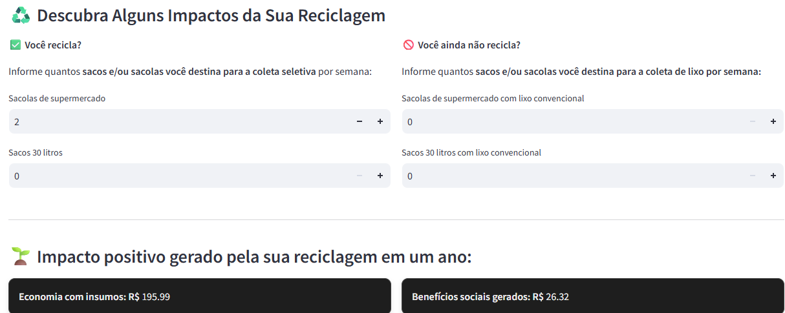

#### pt

Este aplicativo traz:

✅ Uma **calculadora interativa** que simula os benefícios da coleta seletiva para os cidadãos.

📊 Um **dashboard** com análises sobre os resíduos sólidos na cidade de **Belo Horizonte**, incluindo dados de impacto ambiental e econômico.

Desenvolvido para aumentar a conscientização e incentivar o descarte correto de resíduos.

## Contexto

"O Projeto Novo Ciclo tem por objetivo contribuir para a ampliação da coleta seletiva em Belo Horizonte, através da otimização da logística reversa de embalagens, unindo esforços de entidades privadas, do poder público e das organizações de catadores(as) de materiais recicláveis.

A iniciativa é realizada pelo Instituto Macuco, com apoio do Ministério Público do Estado de Minas Gerais, por meio da Plataforma Semente em parceria com CeMAIS.

Com uma abordagem inovadora o projeto busca fortalecer a coleta seletiva e a logística reversa de embalagens no município, de forma colaborativa. Ao promover a união de forças, a sustentabilidade, a inclusão social e a valorização do trabalho das (os) catadoras (es), o projeto não apenas visa estabelecer Belo Horizonte como um modelo de economia circular, mas também oferece uma estrutura replicável para outras cidades, ampliando o impacto positivo e promovendo práticas ambientais mais justas e eficazes em todo o país.

Alinhado ao Plano Municipal de Gestão Integrada de Resíduos Sólidos (PMGIRS) e ao Plano Nacional de Resíduos Sólidos (Planares), o projeto Novo Ciclo representa um passo importante rumo a uma cidade mais sustentável.

Neste sentido, o Projeto Novo Ciclo visa responder a essas necessidades urgentes, alinhando-se às metas estabelecidas pelo PMGIRS e PLANARES propondo soluções que garantam a união de forças entre os agentes públicos e privados envolvidos na coleta seletiva e na logística reversa de embalagens.

Os dados utilizados no app e dashboard foram retirados do minucioso levantamento feito pelo Projeto Novo Ciclo

[Novo Clico Resíduos](https://novocicloresiduos.com.br/noticias-nc-apresentacao)  

## Projeto

### Dashboard

O aplicativo desenvolvido em formato web foi idealizado, inicialmente, com foco no cidadão. Seu principal objetivo é disponibilizar, de forma visual e interativa, as informações levantadas pelo Projeto Novo Ciclo, por meio de um dashboard (Power BI) que facilite a compreensão dos dados e estimule o envolvimento da população com a temática.

A análise dos dados evidencia o potencial para ampliamento do descarte correto de materiais:

E os benefícios que poderiam estar sendo gerados:

### Calculadora pessoal: benefícios gerados pela coleta seletiva

Um dos recursos implementados no app é a mensuração do impacto da coleta seletiva, com base na metodologia proposta pela Pesquisa sobre Pagamento pelos Serviços Urbanos para Gestão de Resíduos Sólidos (IPEA, 2010). Ainda que adotando premissas conservadoras, essa abordagem pode funcionar como uma ferramenta de engajamento, incentivando o descarte correto de resíduos e promovendo maior conscientização ambiental. Essa mensuração é disponibilizada por meio de  uma calculadora individual, que permite ao usuário visualizar os benefícios gerados — ou que poderiam ter sido gerados — a partir da sua participação na coleta seletiva. Essa funcionalidade reforça a percepção de impacto pessoal e pode contribuir para mudanças de comportamento.

[Clique aqui e acesse o app](https://teste-cel-nc.onrender.com/)  

#### en
This application offers:
✅ An interactive calculator that simulates the benefits of selective waste collection for citizens.

📊 A dashboard with analyses of solid waste in the city of Belo Horizonte, including data on environmental and economic impact.

Developed to raise awareness and encourage proper waste disposal.

## Context

The Novo Ciclo Project aims to expand selective waste collection in Belo Horizonte by optimizing reverse logistics of packaging waste, bringing together efforts from private entities, public authorities, and waste picker organizations.

The initiative is carried out by Instituto Macuco, with support from the Ministry of Public Affairs of the State of Minas Gerais, through the Plataforma Semente, in partnership with CeMAIS.

With an innovative approach, the project seeks to strengthen selective waste collection and reverse logistics in the city through collaboration. By promoting joint efforts, sustainability, social inclusion, and the recognition of the work of recyclable material collectors, the project not only aims to establish Belo Horizonte as a model of circular economy but also provides a replicable structure for other cities — expanding its positive impact and promoting fairer and more effective environmental practices throughout the country.

Aligned with the Municipal Plan for Integrated Solid Waste Management (PMGIRS) and the National Solid Waste Plan (Planares), the Novo Ciclo project represents a significant step toward a more sustainable city.

In this sense, Novo Ciclo aims to respond to these urgent needs, aligning with the goals established by PMGIRS and Planares by proposing solutions that foster collaboration between public and private agents involved in selective waste collection and reverse logistics.

The data used in the app and dashboard was taken from the detailed survey conducted by the Novo Ciclo Project.

[Novo Ciclo – Waste Management](https://novocicloresiduos.com.br/noticias-nc-apresentacao)  

## Project
### Dashboard

The web-based application was initially designed with a focus on the citizen. Its main goal is to visually and interactively present the information collected by the Novo Ciclo Project through a Power BI dashboard, making data easier to understand and encouraging public engagement with the topic.

The data analysis highlights the potential to increase proper waste disposal:

And the benefits that could be generated:

Personal Calculator: Benefits of Selective Waste Collection
One of the app's features is the ability to measure the impact of selective waste collection, based on the methodology proposed by the study “Payment for Urban Services in Solid Waste Management” (IPEA, 2010). Even using conservative assumptions, this approach can serve as an engagement tool, encouraging proper waste disposal and raising environmental awareness.

This measurement is provided through a personal calculator, which allows users to visualize the benefits — or potential benefits — generated through their participation in selective collection. This feature reinforces a sense of personal impact and can help drive behavioral change.

👉 [Click here to access the app](https://teste-cel-nc.onrender.com/)

